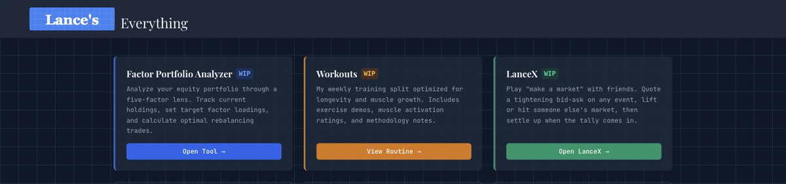

# Lance's Everything

Personal tools that had no business being in the same repo, sharing one React
frontend and one FastAPI backend: a **factor portfolio analyzer**, a **training
program**, a **market-making game** for game nights, and a **gym session timer**
built for one specific athlete.

**[lances.site](https://lances.site)** · React + TypeScript + Tailwind · FastAPI



| | What it is | Docs |
|---|---|---|
| 📈 **[Factor Portfolio Analyzer](https://lances.site/portfolio)** | Five-factor loadings, expected returns, and share-level rebalancing trades | [docs/portfolio.md](docs/portfolio.md) |
| 🏋️ **[Workouts](https://lances.site/workout)** | A weekly split with per-muscle-head activation ratings and demo clips | [docs/workout.md](docs/workout.md) |
| ⏱️ **[Trainer](https://lances.site/trainer)** | A press-play timer that walks through a training program one step at a time | [docs/trainer.md](docs/trainer.md) |
| 📊 **[LanceX](https://lances.site/exchange)** | "Make a market" with friends — quote it, trade it, settle it | [docs/exchange.md](docs/exchange.md) |
| 🗂️ **[Fund Placement](https://lances.site/placement)** | Which account each fund belongs in, ranked by the tax drag a shelter removes | [docs/placement.md](docs/placement.md) |

---

## 📈 Factor Portfolio Analyzer

Most people hold a pile of ETFs with no idea what their aggregate factor exposure
actually is. This computes it — Fama–French five-factor loadings across the whole
portfolio, expected returns from configurable premium assumptions, drift from a
target sourced live from MSCI ACWI weights, and the exact trades to close the gap.


Point it at a portfolio and ask what a $1,000 contribution should buy:

```bash
curl -sX POST localhost:8000/api/portfolio/rebalance \
  -H 'Content-Type: application/json' -d '{"infusion": 1000}'
```

| Ticker | Current | Adjustment | Final |
|--------|---------|-----------|-------|
| AVES\* | 20.00 sh | −$130.12 (−2 sh) | 18.00 sh |
| AVUV | 52.00 sh | +$148.34 (+1.17 sh) | 53.17 sh |
| AVDV | 15.00 sh | +$981.78 (+8.87 sh) | 23.87 sh |

\* AVES can't be bought fractionally, so its adjustment rounds to whole shares and
the $31.89 of rounding error is redistributed across the fractional positions by
target weight. Every dollar of the infusion gets deployed, exactly.

**[→ The model, the math, and the worked example](docs/portfolio.md)**

---

## 🏋️ Workouts

A six-day split optimized for longevity first and hypertrophy second. Every
exercise is rated 1–5 on how hard it hits each muscle **head** — sternal vs.
clavicular chest, long vs. lateral triceps — with a demo clip deep-linked to the
right timestamp and a fallback for when the machine is taken.


Those ratings sum into a daily radar, so an under-trained head is visible rather
than theoretical:


Sunday swaps the table for a HIIT protocol card — Norwegian 4×4, Tabata, Sprint 8,
or 30-20-10 — each with its interval structure drawn to scale.

**[→ The split, the rating system, and the protocols](docs/workout.md)**

---

## ⏱️ Trainer

The workouts page above is a reference you read. This one is a tool you operate
mid-set. It's built for someone training alone on an erratic schedule, and it does
one thing: press play, and it says what to do *right now*.

Each step is a movement, a set count and a countdown. The colour of the screen is
the mode — amber for a working set, sky for rest, slate for walking to the next
machine — so which one she's in reads from across the squat rack without resolving
any text. Rests run themselves out with a chime; a set never starts on its own,
because the gap between the rest ending and actually being under the bar is real.

A chip in the header tracks cumulative drift against the plan, live. Finishing a
set early banks time; pausing, dawdling, or running long bleeds it. Resting for the
full two minutes she was given never makes her look late.

The underlying block is 45 minutes hard-capped and budgeted at ~34, and the timer
spends the headroom on purpose — it runs ~44, because being rushed is what ends
training blocks and finishing early is the correct error.

**[→ The session model, the drift maths, and what the program constrains](docs/trainer.md)**

---

## 📊 LanceX

Someone names a number nobody knows yet — *slides in Tyler's deck*, *minutes until
the first "circle back"*. Everyone competes to quote the tightest two-sided market
on it. Each quote has to be **strictly narrower** than the last; the last one
standing becomes the market maker and takes the other side of every trade.


```
alice  15 @ 25   spread 10
bob    18 @ 22   spread 4      ← narrower, bob takes over
carol  pass
alice  pass                    → bob is the maker, market is 18 @ 22

alice  lifts at 22       carol  hits at 18       dave  lifts at 22
settles at 24  →  alice +$2   carol −$6   dave +$2   bob +$2
```

Live leaderboard, per-player positions marked against the running tally, full
quote history per market, and finished game nights archived as JSON and replayed
in a read-only recap tab.


**[→ Rules, phases, admin tools, and the API](docs/exchange.md)**

---

## Running it

```bash
# API — Python 3.12 (pinned deps have no 3.13 wheels)
cd backend && python3.12 -m venv venv && ./venv/bin/pip install -r requirements.txt
EXCHANGE_DEV=1 ./venv/bin/uvicorn app.main:app --reload --port 8000

# App — Vite proxies /api to :8000, so dev is same-origin
cd frontend && npm install && npm run dev
```

Then open `localhost:5173`. Holdings and assumptions live in `config.yaml` at the
project root; the workout program is `frontend/src/data/workoutData.ts`; LanceX
keeps all its state in memory and starts empty.

**[→ Layout, environment variables, caching, and deployment](docs/development.md)**

---

*Personal project. The portfolio tool is not investment advice and the workout
program is not training advice — both are one person's opinions, made legible.*
