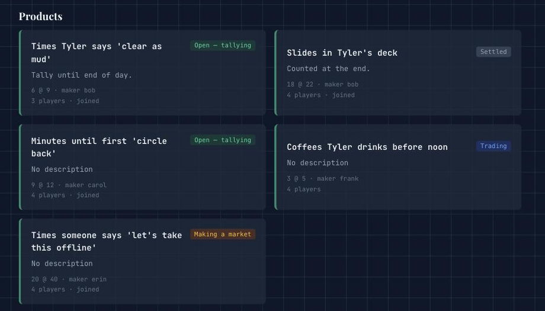
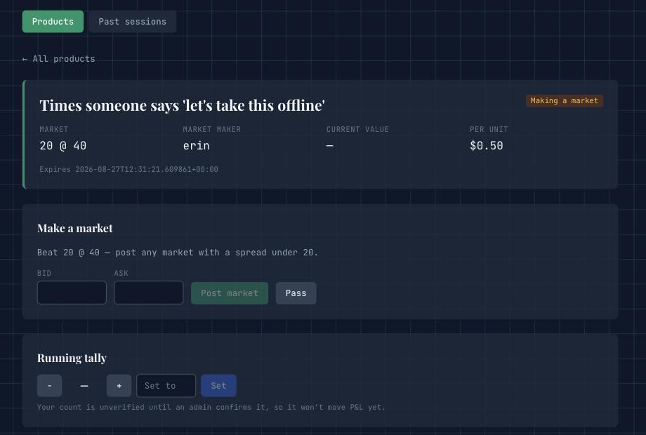
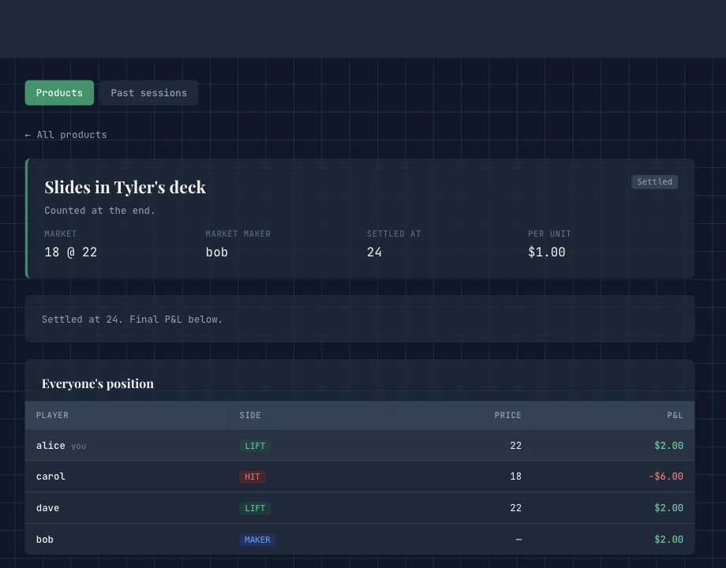
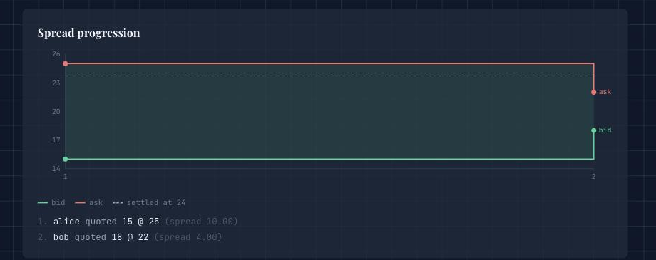
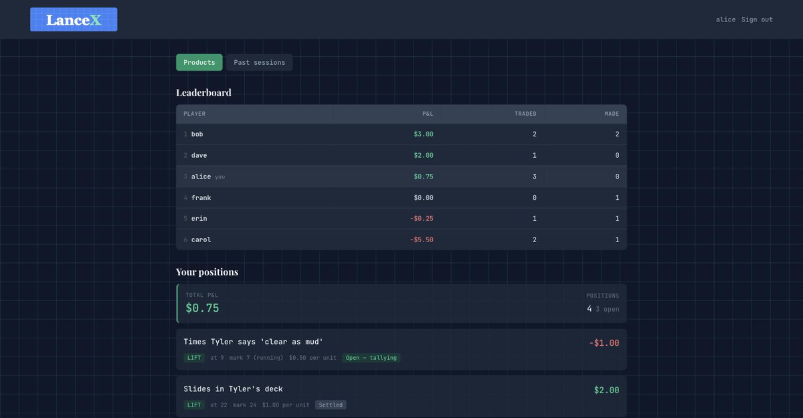
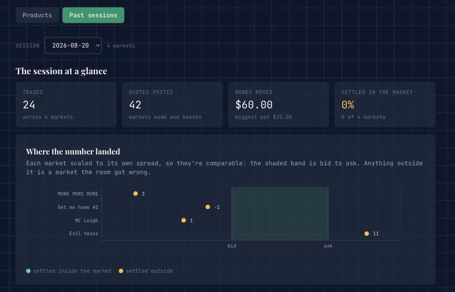

# LanceX

A "make a market" game for a room full of friends. Someone proposes a number
nobody knows yet — *slides in Tyler's deck*, *minutes until the first "circle
back"* — everyone competes to quote the tightest two-sided market on it, and the
last one standing takes the other side of every trade.

Live at [lances.site/exchange](https://lances.site/exchange) · [← back to README](../README.md)



---

## How a round works

Each product moves through four phases. The board shows every product's phase at
a glance, and phases advance automatically once everyone has acted.

### 1. Quoting — "make a market"



Players post a bid/ask. After the first quote, **every subsequent quote must be
strictly narrower than the standing one** — only the spread has to shrink, so the
market is free to slide up or down as it tightens. Anyone who doesn't want to
compete **passes** and waits for the trading phase. When everyone but the
standing quoter has passed, that quoter becomes the **market maker** and quoting
closes.

```
alice  15 @ 25   spread 10
bob    18 @ 22   spread 4      ← narrower, bob takes over
carol  pass
alice  pass                    → bob is the maker, market is 18 @ 22
```

### 2. Trading

Everyone except the maker either **lifts the ask** (buy) or **hits the bid**
(sell), once, with no take-backs. The maker takes the other side of all of it.
Anyone who joined but never acted gets a coin-flipped side when trading closes —
sitting out isn't an escape, and it keeps the maker's book from being one-sided.

### 3. Open — tallying

Trades are locked and the real number starts accruing. Players can nudge a
**running tally** up or down, but a player's count stays *unverified* until an
admin confirms it, so P&L only ever marks against a number the admin stands
behind. An expiry, if set, is a soft gate: it blocks new quotes and trades but
never auto-settles.

### 4. Settled

The admin fixes the final value and P&L is realised:

```
buy   →  (settle − ask) × unit_value
sell  →  (bid − settle) × unit_value
maker →  −(everyone else's total)
```



Continuing the example above at $1.00 per unit, settling at **24**:

| Player | Side | Price | P&L |
|--------|------|-------|-----|
| alice | lift | 22 | +$2.00 |
| carol | hit | 18 | −$6.00 |
| dave | lift | 22 | +$2.00 |
| bob | **maker** | — | +$2.00 |

Carol sold at 18 into a number that printed 24 — six units wrong. Bob made a
market four wide and came out ahead of it.

Every round keeps its full quote history, so you can see how the spread collapsed:



---

## Standings and recaps

Live P&L across every product, plus each player's own positions with the mark
they're currently carried at:



Finished game nights are archived as JSON and replayed in a read-only **Past
sessions** tab — session stats, a session P&L table, and a chart of where each
number actually landed relative to the market that was made on it:



Each market is normalized to its own spread (0 = bid, 1 = ask), so a two-wide
market and a ninety-wide one are comparable on the same axis. Points inside the
shaded band are markets the room got right; points outside are the ones it
didn't.

---

## Admin

Any account can be granted admin, so one person isn't stuck running the whole
night. Admins get a panel to:

- create products (name, description, expiry, dollars per unit)
- confirm a player's proposed tally, or write the confirmed value directly
- settle a market, or force a stalled phase forward
- remove a player's position, delete a product, delete a user, grant admin
- export the session archive, and clear the session for a fresh night

The built-in `admin` account can't be deleted or demoted.

### Archiving a session

```bash
curl -s localhost:8000/api/exchange/export.json -H "Authorization: Bearer $TOKEN" \
  > frontend/src/data/sessions/2026-08-20.json
```

Files in `frontend/src/data/sessions/` are bundled at build time via
`import.meta.glob`, so committing one is all it takes to make it show up in the
session picker — no manifest, and no API call from the deployed frontend.

---

## Design notes

- **State is in memory** (`backend/app/services/exchange_service.py`) — module-level
  dicts behind an `RLock`, wiped on restart. Fine for a 5–20 player game, and it
  keeps the whole thing dependency-free. It does mean **exactly one worker**: with
  more, players would land on different processes and see different markets.
- **Accounts are created on first login.** No signup flow, no email — a username
  and a password, because the barrier to entry has to be lower than the time it
  takes to explain the game.
- **Polling, not websockets.** One fat `GET /state` returns everything the client
  needs to render, which at this scale is simpler and sturdier than a socket
  that has to survive phones locking mid-round.
- **Rule violations are messages, not errors.** Every refusal comes back as a
  400 with a sentence a player can act on ("Your spread must be narrower than 4").

## API

All routes are under `/api/exchange` and take `Authorization: Bearer <token>`.

| Method | Path | Who |
|--------|------|-----|
| `POST` | `/login` | anyone — creates the account if new |
| `GET` | `/state` | player — products, positions, leaderboard |
| `POST` | `/products/{id}/join` · `/quote` · `/pass` · `/trade` | player |
| `POST` | `/products/{id}/value` | player (proposal) or admin (confirmed) |
| `POST` | `/products` · `/products/{id}/value/confirm` · `/settle` · `/advance` | admin |
| `DELETE` | `/products/{id}` · `/products/{id}/positions/{user}` · `/users/{user}` | admin |
| `PUT` | `/users/{user}/admin` | admin |
| `GET` | `/export.json` | admin |
| `POST` | `/session/clear` | admin |
| `POST` | `/dev/seed?phase=&full=` | local only, gated behind `EXCHANGE_DEV=1` |

## Running it locally

The repo ships two Claude Code skills for this:

```
/test-exchange [QUOTING|TRADING|OPEN] [--full]   # both servers + a seeded game
/stop-exchange                                    # tear them down
```

By hand:

```bash
cd backend && EXCHANGE_DEV=1 ./venv/bin/uvicorn app.main:app --reload --port 8000
cd frontend && npm run dev
curl -X POST 'localhost:8000/api/exchange/dev/seed?phase=OPEN&full=1'
```

The seed wipes state and rebuilds a game with mock players (`alice`/`bob`/`carol`,
password `pass`) and an `admin`/`admin_pass` account. `--full` adds three more
players and parks a product in every phase, for testing the board rather than a
single round.
