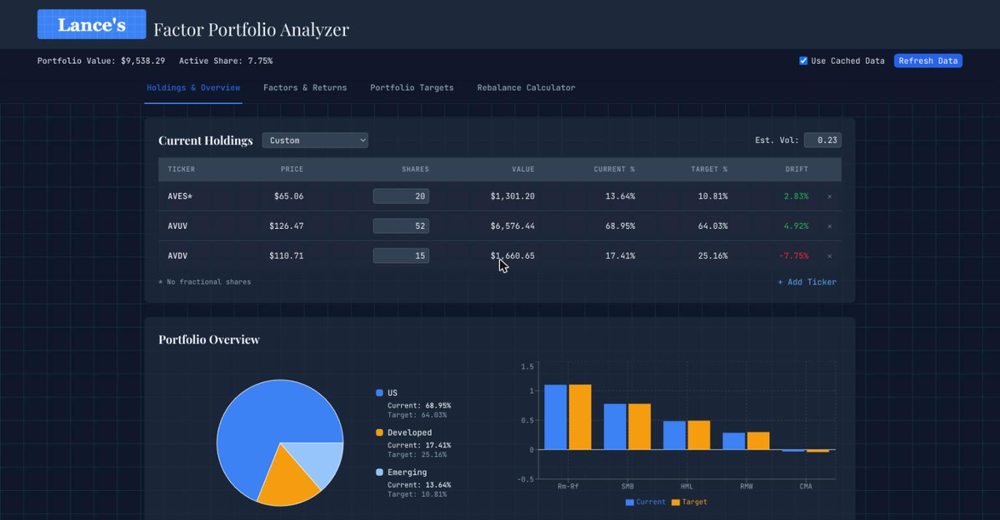
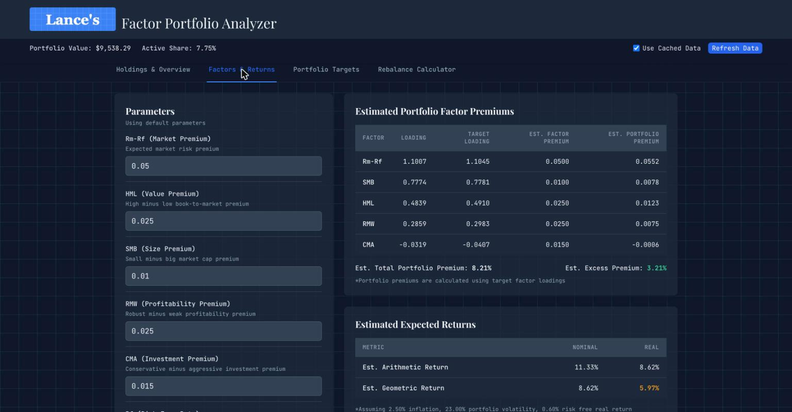
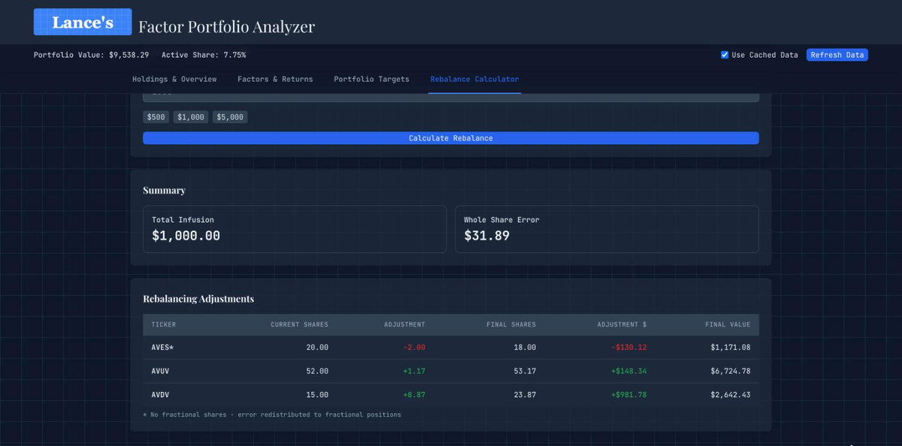

# Factor Portfolio Analyzer

Evaluates an equity portfolio through the lens of the **Fama–French five-factor
model**: current factor loadings, expected returns, drift from target, and the
exact share-level trades needed to close the gap.

Live at [lances.site/portfolio](https://lances.site/portfolio) · [← back to README](../README.md)



---

## The model

The [five-factor model](https://www.sciencedirect.com/science/article/abs/pii/S0304405X14002323)
attributes returns to five systematic risk premiums:

| Factor | Symbol | Captures |
|--------|--------|----------|
| Market excess return | **Rm-Rf** | Broad equity risk premium |
| Size | **SMB** | Small-cap premium (Small Minus Big) |
| Value | **HML** | Value premium (High Minus Low book-to-market) |
| Profitability | **RMW** | Profitability premium (Robust Minus Weak) |
| Investment | **CMA** | Investment premium (Conservative Minus Aggressive) |

Each ETF carries a pre-configured loading per factor (in `config.yaml`, estimated
from its historical return series against the Fama–French factor data). The
portfolio's loading on factor $f$ is the value-weighted average:

$$\beta_f = \sum_i w_i \cdot \beta_{f,i}, \qquad w_i = V_i / V_{\text{total}}$$

## Supported ETFs

| Ticker | Name | Region | Role | Fractional |
|--------|------|--------|------|------------|
| **AVUV** | Avantis U.S. Small Cap Value | US | Satellite (small + value) | yes |
| **DFUS** | Dimensional US Equity | US | Core (market) | no |
| **AVDV** | Avantis International Small Cap Value | Developed | Satellite (small + value) | yes |
| **DFAI** | Dimensional International Core Equity | Developed | Core (market) | no |
| **AVES** | Avantis Emerging Markets Value | Emerging | Satellite (value) | no |
| **AVEM** | Avantis Emerging Markets Equity | Emerging | Core (market) | yes |

---

## How targets are derived

### 1. Regional split — live from MSCI ACWI

The US / Developed ex-US / Emerging target split comes from **MSCI ACWI country
weights**, bucketed into the three regions and normalized to 1.0 (removing cash
drag). South Korea is bucketed as emerging, matching how DFA and Avantis classify
it in the funds actually held.

The feed is fetched from `stockanalysis.com`'s free ACWI holdings JSON, cached to
`.cache/market_split.json`, and falls back to the last-known snapshot if the live
source is down — the UI shows a stale-data indicator rather than failing.
See `backend/app/services/market_service.py`.

### 2. Core–satellite blend inside each region

Each region has a high-tilt satellite fund and a moderate core fund. The blend is
solved so the region hits its **target HML (value) loading** exactly:

$$w_{\text{satellite}} = \frac{L_{\text{target}} - L_{\text{core}}}{L_{\text{satellite}} - L_{\text{core}}}$$

With `target_value_loadings: 1.0`, the target is above the satellite's own loading,
so the blend clamps to 100% satellite. Lower it to blend the core fund back in —
e.g. a US target of 0.35 with AVUV (HML 0.54) and DFUS (HML 0.00) gives roughly
65% / 35%.

### 3. Target proportion per fund

$$w_i^* = \text{regional split}_{\text{region}(i)} \times \text{blend}_i$$

### 4. Active share

How far the portfolio has drifted from those targets:

$$\text{Active Share} = \frac{1}{2}\sum_i \left| w_i - w_i^* \right|$$

0% is perfect alignment. Ordinary drift from market moves and contributions runs
5–15%.

---

## Expected returns



Premium assumptions are editable in the UI and persisted in `config.yaml`:

| Assumption | Default |
|------------|---------|
| Rm-Rf (market premium) | 5.0% |
| SMB (size premium) | 1.0% |
| HML (value premium) | 2.5% |
| RMW (profitability premium) | 2.5% |
| CMA (investment premium) | 1.5% |
| Rf (real risk-free rate) | 0.6% |
| Inflation | 2.5% |
| Portfolio volatility (σ) | 23% |

$$E[r_{\text{real, arith}}] = \sum_f \beta_f \lambda_f + R_f$$

$$E[r_{\text{nom, arith}}] = (1 + E[r_{\text{real, arith}}])(1 + \pi) - 1$$

$$E[r_{\text{real, geo}}] = E[r_{\text{real, arith}}] - \frac{\sigma^2}{2}$$

$$E[r_{\text{nom, geo}}] = (1 + E[r_{\text{real, geo}}])(1 + \pi) - 1$$

The geometric figure is the one that matters in practice — the compound annual
growth rate an investor actually experiences, after the volatility drag of a 23%
standard deviation portfolio.

---

## The rebalancing engine

Given an optional cash **infusion**:

1. `total_value = current_value + infusion`
2. `target_value = target_proportion × total_value` for each position
3. `adjustment = target_value - current_value`
4. Positions that **don't support fractional shares** (DFUS, DFAI, AVES) round to
   whole shares; the dollar rounding error accumulates
5. That accumulated error is **redistributed pro-rata** across the
   fractional-eligible positions (AVUV, AVDV, AVEM), by target weight

So the total deployed always matches the infusion exactly — fractional positions
absorb the residual from whole-share positions. The **Whole Share Error** shown in
the UI is that residual; small is good.

---

## Worked example

A three-fund satellite portfolio that has drifted — developed markets are light
after a US run-up.

### Holdings

| Ticker | Shares | Price | Value | Current | Target | Drift |
|--------|--------|-------|-------|---------|--------|-------|
| AVUV | 52 | $126.47 | $6,576.44 | 68.95% | 64.03% | +4.92% |
| AVDV | 15 | $110.71 | $1,660.65 | 17.41% | 25.16% | **−7.75%** |
| AVES | 20 | $65.06 | $1,301.20 | 13.64% | 10.81% | +2.83% |

**Total $9,538.29 · active share 7.75%**

### Factor loadings and expected return

| | Rm-Rf | SMB | HML | RMW | CMA |
|-|-------|-----|-----|-----|-----|
| Loading | 1.1007 | 0.7774 | 0.4839 | 0.2859 | −0.0319 |
| Target | 1.1045 | 0.7781 | 0.4910 | 0.2983 | −0.0407 |
| × premium | 0.0552 | 0.0078 | 0.0123 | 0.0075 | −0.0006 |

Total portfolio premium **8.21%**, of which **3.21%** is excess over a plain
market portfolio.

| | Nominal | Real |
|-|---------|------|
| Arithmetic | 11.33% | 8.62% |
| **Geometric (CAGR)** | **8.62%** | **5.97%** |

### Rebalance with a $1,000 infusion



| Ticker | Current | Adjustment | Final shares | Final value |
|--------|---------|-----------|--------------|-------------|
| AVES\* | 20.00 | −$130.12 (−2 sh) | 18.00 | $1,171.08 |
| AVUV | 52.00 | +$148.34 (+1.17 sh) | 53.17 | $6,724.78 |
| AVDV | 15.00 | +$981.78 (+8.87 sh) | 23.87 | $2,642.43 |

\* whole shares only. AVES's raw adjustment rounds to −2 shares, a $31.89
overage, which is redistributed across AVUV and AVDV by target weight. Net
deployed: exactly $1,000.00.

The engine will happily sell to rebalance; with a large enough infusion every
adjustment is a buy.

---

## Configuration

`config.yaml` at the project root drives everything:

```yaml
current_portfolio:
  - ticker: AVUV
    shares: 11.94476
  - ticker: AVDV
    shares: 5.45139

factor_premiums:
  Rm-Rf: 0.05     # market risk premium
  SMB: 0.01       # size
  HML: 0.025      # value
  RMW: 0.025      # profitability
  CMA: 0.015      # investment
  Rf: 0.006       # real risk-free rate
  inflation: 0.025
  vol: 0.23       # portfolio volatility

equities:
  AVUV:
    market_loading: 1.07
    size_loading: 0.89
    value_loading: 0.54
    profitability_loading: 0.28
    investment_loading: -0.08
    region: US
    fractional: true
  # … one block per ticker

target_value_loadings:
  US: 1.0         # controls the DFUS / AVUV blend
  Developed: 1.0  # DFAI / AVDV
  Emerging: 1.0   # AVEM / AVES
```

Edits made in the UI (premiums, loadings, target loadings, regional split) are
written back to this file. Custom portfolios entered in the Holdings tab are an
in-memory override instead — they don't touch `config.yaml`, and clear on restart.

## API

| Method | Path | Purpose |
|--------|------|---------|
| `GET` | `/api/portfolio` | Positions, values, drift, active share |
| `GET` | `/api/portfolio/regional-distribution` | Current vs target by region |
| `GET` | `/api/portfolio/factor-analysis` | Loadings, premiums, expected returns |
| `POST` | `/api/portfolio/rebalance` | Trades for a given `infusion` |
| `GET` | `/api/config` | Premiums, equity loadings, target loadings |
| `PUT` | `/api/config/factor-premiums` · `/equity/{ticker}` · `/target-value-loadings` · `/regional-split` · `/portfolio` | Update config |
| `GET` | `/api/config/target-proportions` | How targets are derived, step by step |
| `GET` | `/api/prices` · `POST /api/prices/update` | Cached / refreshed share prices |

Prices come from Yahoo Finance's chart API and are cached in
`.cache/stock_prices.json`; every read endpoint takes `?use_cache=true` to skip
the network entirely.

```bash
curl -s localhost:8000/api/portfolio/factor-analysis?use_cache=true | jq '.expected_returns'
curl -s -X POST localhost:8000/api/portfolio/rebalance \
  -H 'Content-Type: application/json' -d '{"infusion": 1000}' | jq '.adjustments[].ticker'
```

---

> Not investment advice — a personal tool, built around one specific portfolio and
> a set of assumptions you should disagree with.
