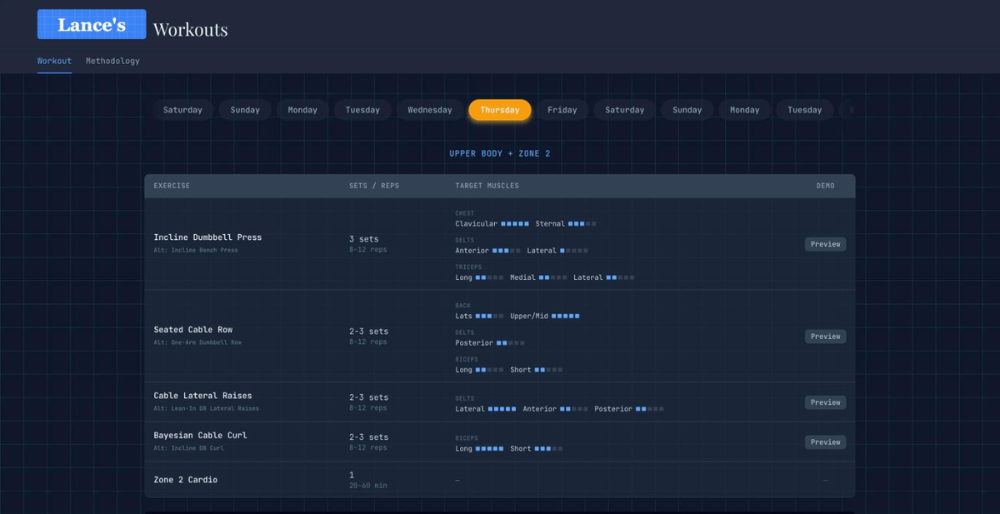
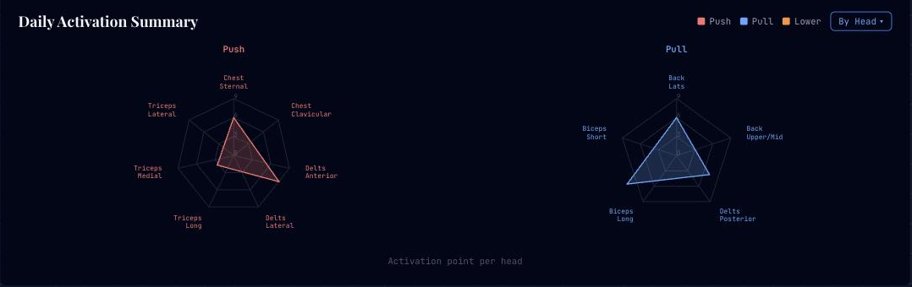
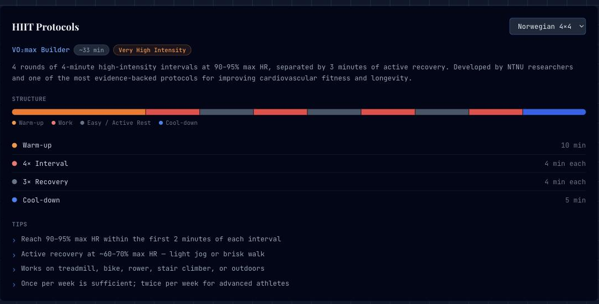

# Workouts

A weekly training split optimized for longevity first and hypertrophy second,
with per-exercise muscle-head activation ratings, embedded demo clips, and a
radar view that shows where the week's stimulus actually lands.

Live at [lances.site/workout](https://lances.site/workout) · [← back to README](../README.md)



This page is static — no backend, no API. Everything lives in
`frontend/src/data/workoutData.ts`.

---

## The split

Six training days, Saturday off. Strength and cardio are blended into the same
session rather than split across days.

| Day | Focus | Cardio |
|-----|-------|--------|
| Monday | Push — chest, shoulders, triceps | Zone 2 |
| Tuesday | Pull — back, rear delts, biceps | Zone 2 |
| Wednesday | Legs — quads, glutes, hamstrings, calves | — |
| Thursday | Upper (gap filler) — upper chest, back, lateral delts, biceps | Zone 2 |
| Friday | Lower (posterior chain) — glutes, hamstrings, calves | — |
| Saturday | Rest | — |
| Sunday | — | Zone 4/5 HIIT |

Design constraints: every **head** of every major muscle gets proportionate
volume across the week, each muscle group is hit at least twice, cardio totals
roughly 2 hours of zone 2 plus ~30 minutes of zone 4/5, and four exercises at
2–3 sets keeps a session under ~50 minutes.

---

## Activation ratings

Each exercise rates 1–5 how strongly it stimulates each muscle **head** it
touches — not just "chest" but sternal vs. clavicular, not just "triceps" but
long / medial / lateral. Ratings are subjective estimates drawn from EMG
literature and expert analysis.

```ts
{
  name: 'Incline Dumbbell Press',
  sets: '3 sets',
  reps: '8-12 reps',
  rest: '2:30',
  targets: [
    { muscle: 'Chest',   head: 'Clavicular', rating: 5 },
    { muscle: 'Chest',   head: 'Sternal',    rating: 3 },
    { muscle: 'Delts',   head: 'Anterior',   rating: 3 },
    { muscle: 'Delts',   head: 'Lateral',    rating: 1 },
    { muscle: 'Triceps', head: 'Long',       rating: 2 },
    // … medial and lateral triceps
  ],
  videoId: 'fGm-ef-4PVk',
  alternative: 'Incline Bench Press',
}
```

`videoId` renders an inline YouTube embed, and the optional `videoStart` (in
seconds) deep-links it to the cue for that specific lift — so a demo is one tap
away mid-set instead of a scrub through a 20-minute video. `alternative` is the
fallback when the machine is taken.

## The radar



Ratings are summed per head across the day:

```ts
aggregateActivations(day)
// → { 'Chest — Sternal': 8, 'Delts — Lateral': 7, 'Triceps — Long': 6, … }
```

Heads are then partitioned into push / pull / lower and drawn as one radar per
group present that day, all sharing a scale so the charts are comparable
side by side. The **By Head / By Group** toggle switches between raw per-head
totals and a per-muscle average taken over *every* head in that muscle —
including untrained ones, so a lift that hammers one head and ignores its
neighbours reads as the partial coverage it is.

Imbalances show up as a lopsided polygon, which is the point: the chart is the
feedback loop for exercise selection.

## HIIT protocols



Sunday swaps the exercise table for a protocol card with four evidence-backed
options, each with an interval breakdown, a proportional structure bar in real
temporal order, and execution tips:

| Protocol | Focus | Time | Intensity |
|----------|-------|------|-----------|
| **Norwegian 4×4** | VO₂max builder | ~33 min | Very High |
| **Tabata** | Anaerobic capacity | ~14 min | Maximum |
| **Sprint 8** | Metabolic conditioning | ~26 min | Maximum |
| **30-20-10** | Aerobic & speed development | ~20 min | High |

---

## Editing

Everything is one typed data file:

- `frontend/src/data/workoutData.ts` — days, exercises, targets, demo clips
- `frontend/src/components/workout/HIITCard.tsx` — protocols and their interval sequences
- `frontend/src/components/workout/MethodologyTab.tsx` — the written methodology

Adding an exercise means appending an `Exercise` to that day's array; the tables,
the radar, and the weekly totals all follow from it.

---

> Not a certified trainer, not medical advice — a personal log, tuned to one
> person's equipment, proportions, and training history.
